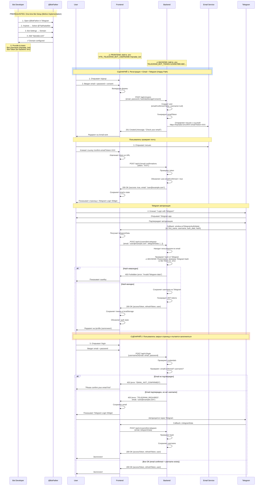
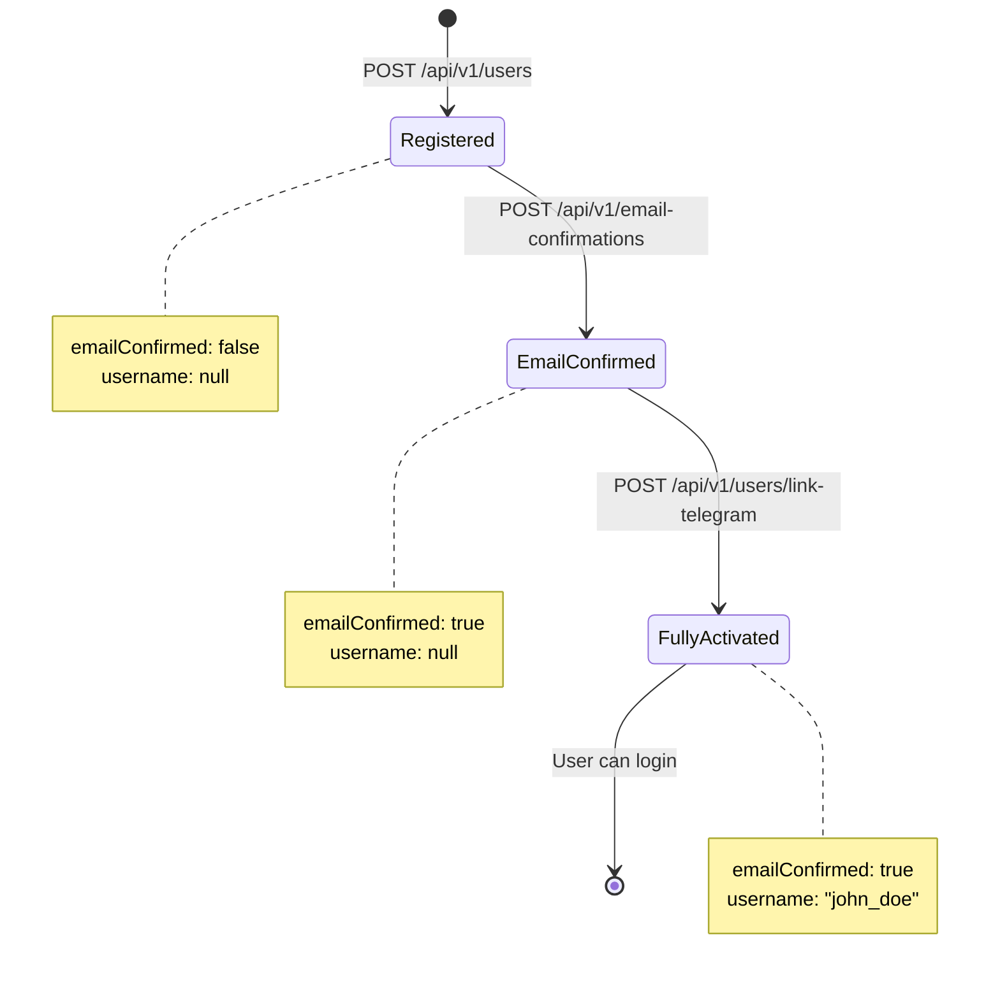
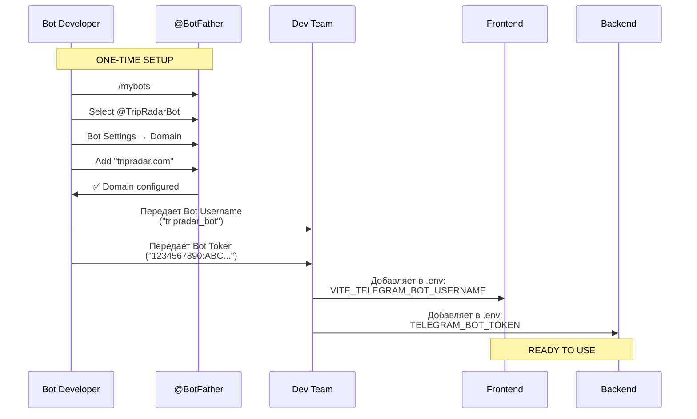

# TripRadar Registration Flow with Telegram Integration

## Complete User Flow Diagram



## Состояния пользователя



## API Endpoints

### 1. Registration

```
POST /api/v1/users
Body: {
  email: string,
  password: string,
  hasDataStorageConsent: boolean
}
Response: {
  message: "Check your email"
}
```

### 2. Email Confirmation

```
POST /api/v1/email-confirmations
Body: {
  token: string
}
Response: {
  success: true,
  email: string  // email пользователя для связывания с Telegram
}
```

### 3. Link Telegram Account

```
POST /api/v1/users/link-telegram
Body: {
  email: string,
  telegramData: {
    id: number,
    first_name: string,
    last_name?: string,
    username?: string,
    photo_url?: string,
    auth_date: number,
    hash: string
  }
}
Response: {
  accessToken: string,
  refreshToken: string,
  user: {
    username: string,
    email: string,
    ...
  }
}
```

### 4. Login

```
POST /api/v1/login
Body: {
  usernameOrEmail: string,
  password: string
}
Response (Success): {
  accessToken: string,
  refreshToken: string,
  user: {...}
}
Response (Telegram Required): {
  error: "TELEGRAM_REQUIRED",
  email: string
}
Response (Email Not Confirmed): {
  error: "EMAIL_NOT_CONFIRMED"
}
```

## Frontend Routes

```
/signup                              - Форма регистрации
/email-sent                          - "Проверьте почту"
/confirm-email?token=XXX             - Подтверждение + Telegram Widget
/login                               - Логин (может показать Telegram Widget)
/profile                             - После успешного логина
```

## Telegram Login Widget Integration

```html
<script
  async
  src="https://telegram.org/js/telegram-widget.js?22"
  data-telegram-login="YOUR_BOT_USERNAME"
  data-size="large"
  data-onauth="onTelegramAuth(user)"
  data-request-access="write"
></script>

<script>
  function onTelegramAuth(user) {
    // user содержит: id, first_name, last_name, username, photo_url, auth_date, hash
    // Отправляем на backend для проверки hash и связывания аккаунта
  }
</script>
```

## Telegram Bot Setup (For Bot Developer)

### Prerequisites

Разработчику Telegram бота нужно выполнить следующие шаги **один раз**:

### Step 1: Configure Bot Domain

1. Открыть @BotFather в Telegram
2. Отправить команду `/mybots`
3. Выбрать вашего бота (например, @TripRadarBot)
4. Выбрать `Bot Settings` → `Domain`
5. Добавить домен: `tripradar.com` (или ваш production домен)
6. Для разработки также добавить: `localhost` или `dev.tripradar.com`

**Важно:** Это не влияет на работу бота! Бот продолжит работать как раньше.

### Step 2: Provide Credentials to Team

Передать команде разработки:

1. **Bot Username** (например, `tripradar_bot`)
   - Нужен для frontend: отображается в Telegram Login Widget
   - Добавить в `.env` как `VITE_TELEGRAM_BOT_USERNAME=tripradar_bot`

2. **Bot Token** (например, `1234567890:ABCdefGHIjklMNOpqrsTUVwxyz`)
   - Нужен для backend: проверка hash от Telegram
   - Добавить в backend `.env` как `TELEGRAM_BOT_TOKEN=...`
   - ⚠️ **СЕКРЕТНЫЙ КЛЮЧ** - никогда не коммитить в git!

### Step 3: Verify Setup

После настройки можно проверить:

```bash
# Проверить, что домен добавлен
# Открыть @BotFather → /mybots → ваш бот → Bot Settings → Domain
# Должен быть указан tripradar.com
```

### Diagram: Bot Setup Flow



### What This Enables

После настройки:

- ✅ Frontend может показывать Telegram Login Widget
- ✅ Пользователи видят знакомое имя бота при логине
- ✅ Backend может проверять подлинность данных от Telegram
- ✅ Бот продолжает работать для других функций (уведомления, команды и т.д.)

### Troubleshooting

**Проблема:** "Bot domain invalid" при попытке логина

- **Решение:** Проверить, что домен добавлен в @BotFather

**Проблема:** "Hash verification failed" на backend

- **Решение:** Проверить, что Bot Token правильный и не истек

**Проблема:** Widget не загружается

- **Решение:** Проверить, что Bot Username правильный в .env

## Security Notes

1. **Hash Verification**: Backend MUST verify Telegram hash using Bot Token
2. **linkToken**: Should expire in 15-30 minutes
3. **emailToken**: Should expire in 24 hours
4. **Bot Token**: NEVER expose on frontend, keep in .env
5. **Domain Whitelist**: Only add trusted domains to bot settings
